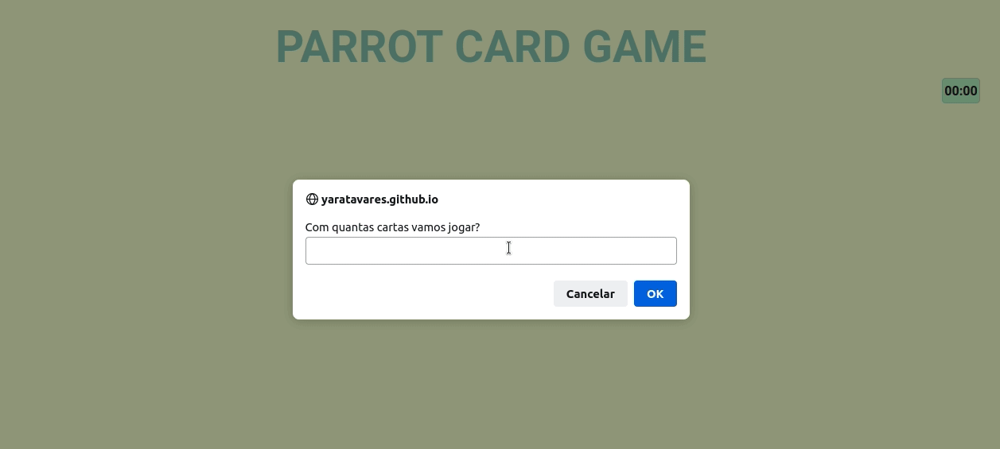

# Parrot-Card-Game

<p align="center">
  
  <a href="https://github.com/yaratavares/CineFlex/commits/main">
    
  </a>
   </p>

<p align="center">
 <a href="#-sobre-o-projeto">Projeto</a> •
 <a href="#-layout">Layout</a> • 
 <a href="#-executar">Executar</a> • 
 <a href="#-tecnologias">Tecnologias</a> • 
 <a href="#-autor">Autor</a> • 
 <a href="#user-content--licença">Licença</a>
</p>

## 💻 Projeto

<p>
Parrot Card Game é um jogo de memória dinâmico e divertido que segue as regras básicas.

No início você poderá escolher com quantas cartas irá jogar e então o temporizador começará a contar. Assim que você acertar todas as cartas do jogo, irá ser exibido um alert com o tempo e quantos cliques foram necessários para finalizar o jogo.
</p>

<p>Quarto projeto desenvolvido no curso de Full-Stack Developer na [Driven Education](https://www.driven.com.br/).</p>

---

## 🎨 Layout

O layout somente para Mobile da aplicação está disponível no Figma:

<a href="https://www.figma.com/file/UkajvEwTQQX9cd63ufYt3T/Parrot-Card-Game">

</a>

### Desktop

  

---

## 🚀 Como executar o projeto

Você pode somente acessar a [página](https://yaratavares.github.io/Parrot-Card-Game/) ou instalar na sua máquina como seguem as instruções a seguir:


#### 🧭 Rodando a aplicação web (Front-end)

```bash
# Clone este repositório
$ git clone git@github.com:yaratavares/Parrot-Card-Game.git
```
Dos arquivos baixados terá um **index.html**, somente dois cliques nesse arquivo irá abrir o browser com a aplicação.

---

## 🛠 Tecnologias

As seguintes ferramentas foram usadas na construção do projeto:

#### **Mobile e Desktop**
<p align="center">
 •
 •
 •

</p>

---

## 🧜‍♀️ Autora

<a href="https://www.linkedin.com/in/yaracristinatavares/" >
 
 <p>Yara Tavares 🚀</p>
</a>
---

## 📝 Licença

Este projeto esta sobe a licença [MIT](./LICENSE).
